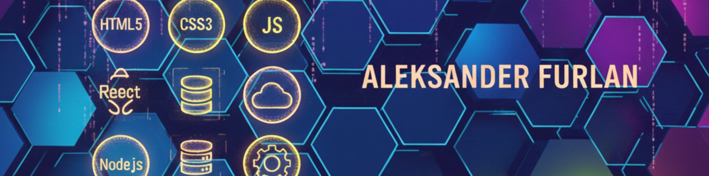

<!-- Banner -->

  

---

# 👋 Olá, tudo bem?

Meu nome é **Aleksander Furlan** e sou um desenvolvedor Front-End apaixonado por tecnologia e por transformar ideias em código.  
Este é o meu espaço no GitHub, onde registro minha evolução, experimentos e projetos que estou construindo ao longo da minha jornada de aprendizagem.

Atualmente estudo **HTML, CSS e JavaScript** pela formação **DevClub (Rodolfo Mori)**, com foco total em criar **landing pages modernas, responsivas e orientadas à conversão**.

---

# 🚀 Tecnologias que estou estudando e praticando

  
  
  
  
  

---

# 🕒 Linha do tempo da minha jornada

### **📅 Novembro / 2025 — Início da caminhada**
- Comecei meus estudos em desenvolvimento Front-End.
- Primeiro contato prático com **HTML, CSS e JavaScript**.
- Construí meu primeiro site do zero como prática.

### **📅 Dezembro / 2025 — Primeiros projetos pessoais**
- Criando layouts simples e responsivos.  
- Melhorando minha base em HTML5, CSS3 e JavaScript.  
- Aplicando boas práticas: acessibilidade, semântica e organização de código.

### **🌱 Em constante evolução…**
Estou diariamente aprendendo, criando projetos novos e aperfeiçoando minhas habilidades.  
Meu objetivo é evoluir até me tornar um **Desenvolvedor Front-End completo**, atuando em:

✔ Landing pages profissionais  
✔ Interfaces modernas e responsivas  
✔ Experiências digitais otimizadas para conversão  

---

# 🔗 Conecte-se comigo

---

# ✨ Sobre mim

Sou movido por desafios, gosto de criar layouts bonitos, funcionais e ver tudo ganhando vida no navegador.  
Resolver problemas me motiva — cada bug corrigido é uma vitória.

Busco boas oportunidades para começar no mercado, construir experiência e também atuar como **freelancer** criando **landing pages profissionais**.  
No futuro, quero construir minha própria **empresa de desenvolvimento**.

---

📌 *Obrigado por visitar meu perfil! Em breve novos projetos estarão por aqui.*  
